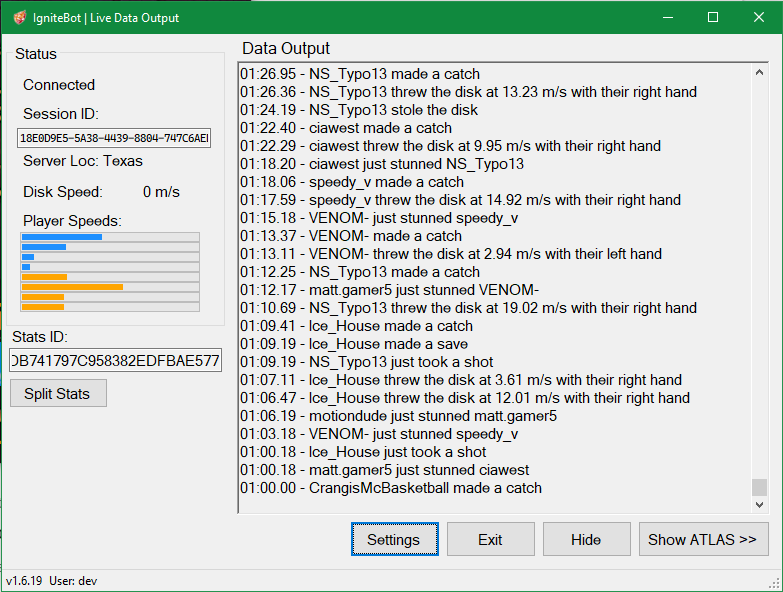
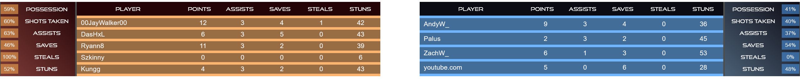
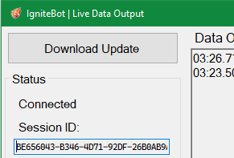
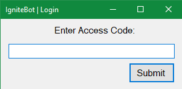
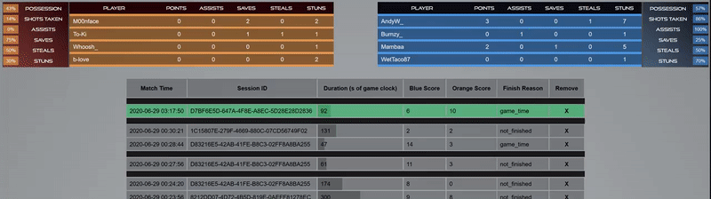

## How to use the IgniteBot for stats when casting

1. Download and install the desktop program with the installer.
   - Updates can be downloaded when they are available from within the app  

2. Enter the access code  
   
   - Either use the code for the season (provided separately), or use a test code
   - To change the code later, click the code in the bottom left of the program
3. The OBS browser source for the end-of-round stats should be https://ignitevr-echostats.web.app/most_recent_match?client_name=[OCULUS_USERNAME] at 1920x1080, where [OCULUS_USERNAME] is the oculus account name of the spectator running the IgniteBot.
   - Append `&series_name=[SERIES_NAME]` to the url (https://ignitevr-echostats.web.app/most_recent_match?client_name=[OCULUS_USERNAME]&series_name=vrml_season_2)
      - valid codes are `vrml_test` and `vrml_season_2`. If no series name is specified, it defaults to `vrml_season_2`
4. The most_recent_match page will aggregate the stats from all rounds with the same `Stats ID`. This id can be changed either by restarting the IgniteBot or by clicking the `Split Stats` button. This should be done between games (not rounds) when the stats should be reset.
5. Use the round grouping website (described below) if special circumstances arise.

### Using the round grouping website
 - To preview or modify the stats shown on the overlay, go to https://ignitevr-echostats.web.app/group_recent_matches?client_name=[OCULUS_USERNAME]
 - The series name can also be specified here appending `&series_name=[SERIES_NAME]` to the url
 - The preview at the top shows what the current overlay would look like.
 - The green highlighted matches are the most recent group - stats are shown from these
 - To add another split, drag a black bar from the top.
 - To remove a split, drag it to the top or next to another black bar
 - While stats update as a round progresses, some updates still require a refresh, so refresh to be sure of what it will look like.

## Overlay sources for team stats:

 - Setup / Choose match
   - https://ignitevr-echostats.web.app/match_setup?client_name=NtsFranz  
   Click on a match to set all the overlays to use that match. If the team are on the wrong side, click the button at the top to switch them.
 - https://ignitevr-echostats.web.app/prematch_overlay?client_name=NtsFranz
 - https://ignitevr-echostats.web.app/prematch_overlay_2?client_name=NtsFranz
 - https://ignitevr-echostats.web.app/midmatch_overlay?client_name=NtsFranz
