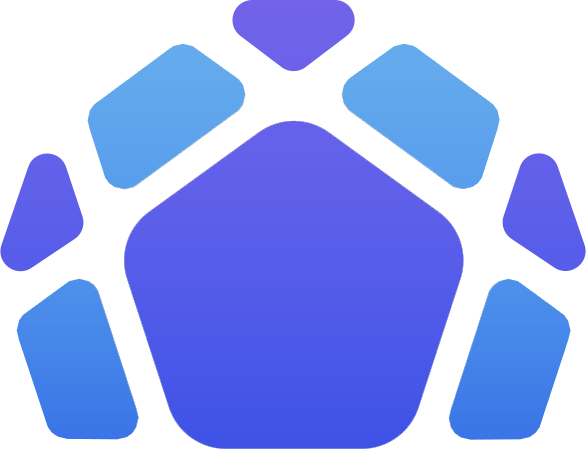

# DOME



https://enterthedome.com/

DOME was a one-off subsidized buy-in tournament with all proceeds funneled directly to the prize pool.

## Features

- Skybox replacement
- Live disc trail
- Goal explosions
- Live joust graphs
- Automatic OBS installation as part of Spark (for casters only)

Examples:

- https://cdn.discordapp.com/attachments/506931756675497986/1051274947399516272/8mb.video-QjQ-oJlLDmAc.mp4
- https://cdn.discordapp.com/attachments/1035803165049753640/1050842478682574990/domerlay.mp4

## Usage

Installation instructions for casters were posted here: https://enterthedome.com/domerlay/

This is a [Svelte](https://svelte.dev/) project. You can build and run using `npm`.

To run locally:

```sh
npm i
npm run dev
```

This runs on http://localhost:5173/dome/. You can use this page in your OBS browser source.

To build static files:

```sh
npm i
npm run build
```

You _must_ be running:

1.  [Spark](https://ignitevr.gg/spark/)
2.  Graic's [WriteAPI](https://github.com/Graicc/WriteAPI)
    - Spark has a button to install this for you.

The primary use for this repository is for inspiration for building your own cool overlays, not for using this directly.
