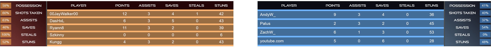

# EchoStats

This is the source to the website for public viewing of VRML and general Echo Arena competitive stats.

## Stats Overlay

### Usage
Run the Session Grabber, then open the following url as a browser source in OBS with resolution 1920x1080:  
https://ignitevr-echostats.web.app/most_recent_match?client_name=[OCULUS_USERNAME]  
The most_recent_match page will aggregate the stats from all rounds with the same `custom_id`. This id can be changed either by restarting the Session Grabber or by clicking the `Split Stats` button.

## VRML Team List

https://ignitevr-echostats.web.app/teams  

Full list of teams and players for VRML S1. Not very useful now, but shows some of the data in the DB.
